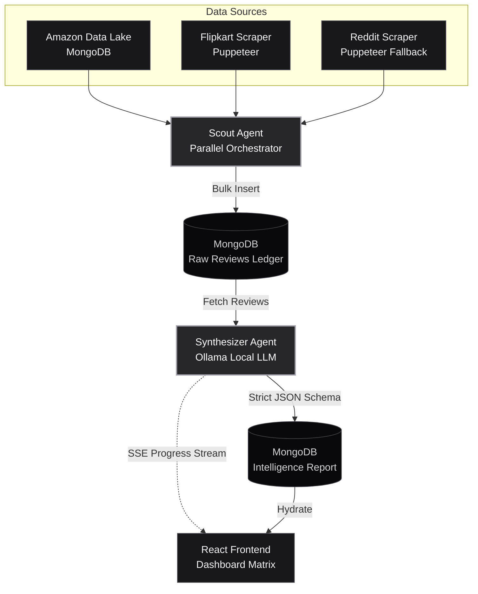

# MarketMind AI

### Autonomous Multi-Agent Market Intelligence Platform

> A full-stack B2B SaaS system that ingests real-time e-commerce reviews from Amazon, Flipkart, and Reddit, synthesizes them through a local LLM (Ollama), and generates actionable competitive product blueprints — all orchestrated through a strict monochrome enterprise UI.

---

## System Architecture



### Data Flow

1. **Scout Agent** — Executes parallel scraping across Amazon (local MongoDB Data Lake), Flipkart (Puppeteer headless), and Reddit (Puppeteer infinite scroll) using `Promise.allSettled` for fault tolerance.
2. **MongoDB Raw Ledger** — All scraped reviews are bulk-inserted into the `RawReview` collection, linked to an `AnalysisSession` tracker.
3. **Synthesizer Agent (SSE)** — Opens a Server-Sent Events stream to the frontend. Fetches reviews from MongoDB, truncates to 6,000 words, and feeds them to the local Ollama LLM with a strict JSON schema prompt.
4. **Ollama Local Inference** — Runs Llama 3 or Mistral locally. The engine enforces structured output. Heartbeat progress logs stream to the client every 5 seconds during generation.
5. **Strict JSON Extraction** — The raw LLM output is cleaned (markdown fences stripped, brace-bounded), parsed, and validated against the `IntelligenceReport` schema.
6. **React Matrix Hydration** — The validated report hydrates three dashboard tabs: Executive Summary, Evidence Explorer, and AI Product Blueprint.

---

## Engineering Resilience & Fallback Cascades

This project was built to handle the inherent chaos of web scraping and non-deterministic LLMs in production:

### 1. Anti-Bot Scraping Fallbacks
Real-world data pipelines constantly face IP bans and 403 errors. The Reddit scraping module implements a graceful fallback cascade:
* **Strategy A:** Attempt `old.reddit.com` scraping.
* **Strategy B (Fallback):** If blocked (403), seamlessly failover to DuckDuckGo via Puppeteer.
* **Infinite Scroll Injection:** Injects a custom DOM scroll script into the headless browser to bypass pagination and extract 30+ deep results without triggering CAPTCHAs.

### 2. SEO Spam Filtration
E-commerce scraping often pulls random SEO tags instead of actual reviews. The Flipkart module strictly filters for verified review DOM selectors. If selectors are missing (due to a UI update), it safely returns `0` rather than hallucinating garbage data that would poison the LLM's context window.

### 3. LLM Schema Enforcement & Lenient Validation
Large Language Models frequently drop JSON keys or hallucinate trailing commas. 
* **Pre-Processing:** The backend strips conversational text and locates the outermost `{}` bounds of the LLM response.
* **Lenient Hydration:** If the LLM omits critical keys (e.g., `vulnerabilityIndex`) due to sparse data, the backend catches the parsing error and safely injects mathematical defaults.
* **Deterministic Fallback:** If the LLM suffers a total collapse, a hardcoded regex fallback calculates sentiment scores natively to ensure the React UI never crashes.

---

## Technical Stack

| Layer | Technology | Purpose |
|-------|-----------|---------|
| **Frontend** | React 19 + Vite 8 | SPA with state-machine view routing |
| **Styling** | Tailwind CSS v4 | Strict monochrome design system (zinc/neutral only) |
| **Icons** | Lucide React | Consistent monochrome iconography |
| **Backend** | Node.js + Express | REST API + SSE streaming endpoints |
| **Scraping** | Puppeteer Extra + Stealth | Flipkart bot-detection bypass |
| **HTTP Client** | Axios | Reddit API + Ollama communication |
| **Database** | MongoDB + Mongoose | Review storage + intelligence report persistence |
| **AI/LLM** | Ollama (Llama 3 / Mistral) | Local inference with JSON-mode output |
| **Containerization** | Docker + Docker Compose | Multi-service orchestration |
| **Reverse Proxy** | Nginx | Production frontend serving + API proxying |

---

## Quick Start

### Prerequisites

- **Node.js** v18+
- **MongoDB** running locally or via Docker
- **Ollama** installed with a model pulled (`ollama pull llama3`)
- **Docker & Docker Compose** (for containerized deployment)

### Local Development

```bash
# 1. Clone and install dependencies
cd marketmind
npm install

# 2. Install server dependencies
cd server
npm install
cd ..

# 3. Start MongoDB (if not using Docker)
mongod --dbpath ./data/db

# 4. Start Ollama
ollama serve

# 5. Start the backend
cd server
node server.js

# 6. Start the frontend (new terminal)
cd ..
npm run dev
```

Frontend: `http://localhost:5173`  
Backend: `http://localhost:5000`

### Docker Deployment

```bash
# Ensure Ollama is running on the host machine
ollama serve

# Build and launch all services
docker-compose up --build

# Access the application
open http://localhost:3000
```

### Pipeline Verification

```bash
cd server
node scripts/verifyPipeline.js
```

This runs automated sanity checks against MongoDB, Reddit API, and Ollama LLM inference.

---

## API Specification

### `GET /api/health`

Health check endpoint.

| Field | Value |
|-------|-------|
| **Response** | `{ "status": "ok", "timestamp": "ISO-8601" }` |

---

### `POST /api/scout`

Triggers the Scout Agent to scrape all platforms in parallel.

**Request Body:**

```json
{
  "query": "iPhone 16",
  "sessionId": "uuid-v4-string"
}
```

**Response (200):**

```json
{
  "message": "Scout Agent completed successfully.",
  "totalReviews": 75,
  "breakdown": {
    "AMAZON": 50,
    "FLIPKART": 12,
    "REDDIT": 13
  }
}
```

---

### `POST /api/synthesize`

Triggers the Synthesizer Agent. Returns a **Server-Sent Events** stream.

**Request Body:**

```json
{
  "query": "iPhone 16",
  "sessionId": "uuid-v4-string"
}
```

**SSE Event Types:**

| Type | Payload | Description |
|------|---------|-------------|
| `log` | `{ "type": "log", "message": "string" }` | Real-time progress updates streamed during LLM inference |
| `complete` | `{ "type": "complete", "payload": IntelligenceReport }` | Final report object matching the Mongoose schema |
| `error` | `{ "type": "error", "message": "string" }` | Pipeline failure notification |

**IntelligenceReport Schema:**

```json
{
  "executiveSummary": {
    "vulnerabilityIndex": 78,
    "platformBreakdown": [
      { "platform": "AMAZON", "positivePercent": 35, "negativePercent": 65 },
      { "platform": "FLIPKART", "positivePercent": 28, "negativePercent": 72 },
      { "platform": "REDDIT", "positivePercent": 16, "negativePercent": 84 }
    ]
  },
  "coreComplaints": [
    {
      "title": "Thermal Throttling Under Load",
      "summary": "Device overheats during intensive tasks.",
      "severity": "High"
    }
  ],
  "productBlueprint": {
    "targetWeaknesses": ["Insufficient thermal management"],
    "engineeringSolutions": ["Vapor chamber cooling system"],
    "bomImpact": "Estimated 12-18% BOM increase per unit."
  }
}
```

---

## Project Structure

```
marketmind/
├── Dockerfile                    # Frontend multi-stage build (Vite → Nginx)
├── docker-compose.yml            # Full-stack orchestration
├── package.json                  # Frontend dependencies
├── vite.config.js                # Vite + Tailwind + API proxy config
│
├── src/                          # React Frontend
│   ├── App.jsx                   # Root shell + state machine
│   ├── index.css                 # Tailwind v4 directives
│   ├── main.jsx                  # Entry point
│   ├── hooks/
│   │   └── useAgentPipeline.js   # Pipeline state + SSE stream reader
│   └── components/
│       ├── Header.jsx            # Persistent navigation bar
│       ├── CommandCenter.jsx     # Search landing view
│       ├── PipelineTracker.jsx   # Live agent processing terminal
│       ├── DashboardContainer.jsx# Tabbed dashboard router
│       └── dashboard/
│           ├── ExecutiveSummary.jsx   # Sentiment + vulnerability metrics
│           ├── EvidenceExplorer.jsx   # Raw review audit log
│           └── ProductBlueprint.jsx  # Engineering recommendations
│
└── server/                       # Express Backend
    ├── Dockerfile                # Backend container (node:20-slim + Chromium)
    ├── package.json              # Server dependencies
    ├── server.js                 # Express entry + route wiring
    ├── controllers/
    │   ├── scoutController.js    # Parallel scraping orchestrator
    │   └── synthesizerController.js  # SSE streaming + LLM orchestrator
    ├── services/
    │   ├── redditScraper.js      # Reddit JSON API scraper
    │   ├── flipkartScraper.js    # Puppeteer + Stealth scraper
    │   ├── amazonIngestion.js    # Mock Kaggle dataset ingestion
    │   └── llmService.js         # Ollama LLM prompt + JSON extraction
    ├── models/
    │   ├── AnalysisSession.js    # Session lifecycle tracker
    │   ├── RawReview.js          # Unified review schema
    │   └── IntelligenceReport.js # Final LLM output schema
    └── scripts/
        └── verifyPipeline.js     # Automated sanity test suite
```

---

## Design System

The UI enforces a **strict monochrome constraint**:

- **Palette**: Absolute Black (`#000`), Absolute White (`#fff`), Tailwind `zinc-50` through `zinc-950`
- **Zero accent colors**: No reds, blues, greens, or any chromatic hues
- **Dark mode default**: Controlled via Tailwind's `dark:` variant with `.dark` class on `<html>`
- **Hierarchy**: Established purely through typographic weight (`font-light` → `font-extrabold`) and spacing
- **Typography**: Monospace for data labels and system text, sans-serif for body content

---

## License

MIT

---

*Built as a B.Tech IT capstone project demonstrating enterprise-grade multi-agent AI architecture, real-time streaming, and production containerization.*
